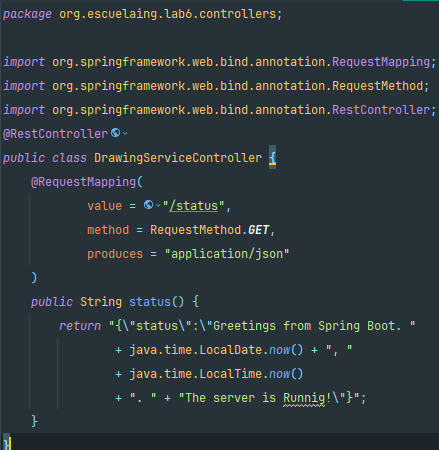

# Spring.io, Websockets, ReactJs-18, P5.js,AWS: buenas prácticas de Diseño

Vamos ahora a construir una aplicación interactiva en tiempo real usando una
buena estrategia de diseño. Para esto vamos a construir una aplicación que
permite dibujar de manera colaborativa en tiempo real.

La aplicación soporta múltiples clientes. La comunicación es en tiempo real.

## Arquitectura

Queremos construir una aplicación web con comunicación bidirectional entre el
cliente y el servidor. Los clientes inician su dibujo y se puede diferenciar su trazo
del trazo de los clientes remotos.

La arquitectura usará ReactJs del lado del cliente y Spring.io del lado del servidor.
En le taller le mostraremos cómo construir una arquitectura escalable y entendible
usando estos elementos.

## Vamos ahora a construir nuestro ejemplo.

### Cree la estructura básica del proyecto

**1. Crear una aplicación java básica usando maven**

**2. Actualizar el pom para utilizar la configuración web-MVC de spring boot. Incluya lo siguiente en su pom**

**3. Cree la siguiente clase que iniciará el servidor de aplicaciones de Spring**

Para los pasos 1,2 y 3 hacemos uso de spring initializr que nos genera de manera automatica todo lo anterior, importante añadir la dependencia de web para el punto 2.

**Clase Main:**

**Archivo POM:**

**4. Cree un controlador Web que le permitirá cargar la configuración mínima Web-MVC**

**5. Cree un index html en la siguiente localización: ``/src/main/resources/static``, corra la clase que acabamos de crear y su servidor debe iniciar la ejecución:**

**6. Verifique que se esté ejecutando accediendo a: ``localhost:8080/status``**

**7. Verifique que el servidor esté entregando elementos estáticos web entrando a: ``localhost:8080/index.html``**

### Ahora construimos el cliente Web

El index.html sería. Solo contiene un elemento “div” con identificador root. A Partir
de este elemento construiremos la aplicación. Observe que esta página se encarga
de cargar las librerías necesarias y el único script dónde estarán nuestros
componentes. Observe que solo usaremos un elemento JSX, es decir no usaremos
archivos Js y JSX, esto facilita la depuración y el mantenimiento.

**8. Editamos el index.html para que quede así:**

### Construyamos el componente ReactJS paso a paso.

**9. Primero construimos una versión simple, en el archivo js/bbComponents.jsx ponemos:**

**10. Ahora extendamos una poco y iremos los elementos principales de la interfaz gráfica:**

**11. Ahora creemos un componente para representar el canvas del tablero:**

**12. Ahora vamos a modificarlo para poder interactuar con el servidor usando web sockets:**

**13. Modifiquemos el componente BBCanvas para utilizar este web socket:**

### Antes de ejecutar vamos a crear los componentes del servidor

**14. Primero el Endpoint:**

**15. Luego el configurador:**

### ¿Podemos subirlo a AWS?

#### Para subirlo a AWS siga los siguientes pasos

**16. Modifique el POM para copiar las dependencias:**

**El git ignore se creó junto al repositorio al inicio del proyecto**

**17. Corra su aplicación desde la línea de comandos**

**Para ello primero ejecutamos ``mvn clean package``**

**Luego ejecutamos ``java -jar target/lab6-0.0.1-SNAPSHOT.jar``**

**Evidencia de que la aplicación corre localmente:**

### Prepare su aplicación para correr en un servidor desconocido

Calcule la dirección del servicio y utilice wss (Protocolo seguro) en cambio de ws
(Protocolo no seguro). Utilice esto solo si el protocolo del servidor será seguro.

**18. Inicie Spring en el puerto indicado por el entorno:**

**Evidencias de que se puede ingresar variables de entorno:**

